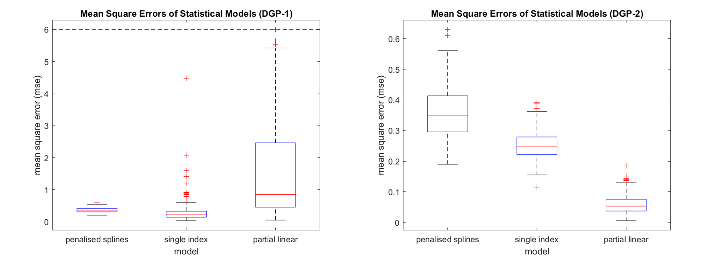
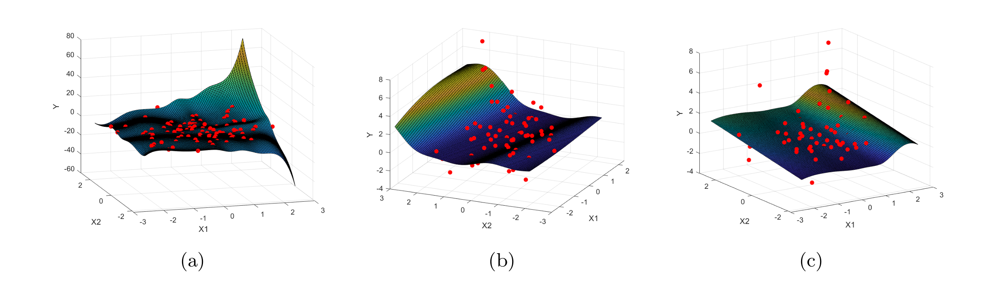
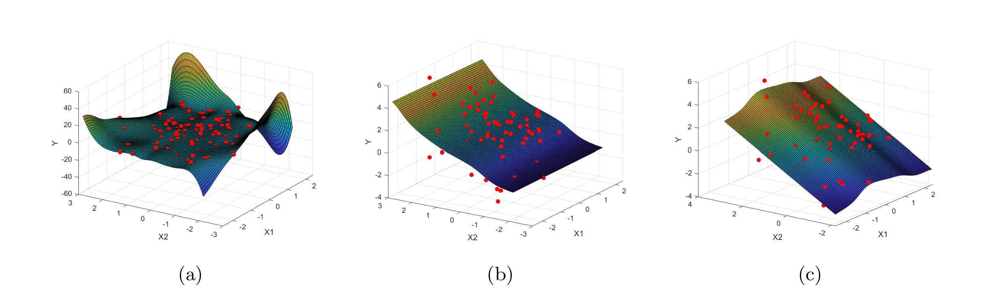

# Implementation and Simulation of Non-Parametric and Semi-Parametric Statistical Models Using MATLAB

## Introduction

This project explores different non-parametric and semi-parametric statistical models that are implemented from scratch using MATLAB. Two simulations are conducted to compare each model, where the data for each simulation is generated from a distinct data generating process (DGP).

## Data Generating Processes (DGPs)

200 random samples $(\mathbf{X}_1, Y_1),...,(\mathbf{X}_n, Y_n)$ where $n=100$ are generated, where 
- $\mathbf{X} = (X_{1}, X_{2}) \sim N(0,\Sigma_X)$ 
- $(k,k')$-element of $\Sigma_X$ is $0.2^{|k-k'|}$ 
- $\epsilon \sim N(0,1)$ independent of $\mathbf{X}$ 
- $Y = m(\mathbf{X}) + \epsilon$
- **DGP-1:** $\;m(\mathbf{x}) = 0.1(\boldsymbol{\beta}^{\top}\mathbf{x})^2 \times e^{0.1\boldsymbol{\beta}^{\top}\mathbf{x}}$, where $\boldsymbol{\beta} = (1/\sqrt{3}, \sqrt{2/3})^{\top}$
- **DGP-2:** $\;m(\mathbf{x}) = \cos(x_1) + x_2$

## Models
- [2 dimensional tensor-product cubic penalised spline model](https://en.wikipedia.org/wiki/Smoothing_spline#Related_methods)
- [Single index model](https://en.wikipedia.org/wiki/Semiparametric_regression)
- [Partial linear model](https://en.wikipedia.org/wiki/Partially_linear_model)

## How to Run Code
Ensure that MATLAB is installed, then follow the steps below:
1. Clone this repository onto your computer.
2. Open MATLAB and navigate to your local copy of the repository.
3. Open the *main.m* file and run the script.

## Results

### Boxplots

*Figure 1: Box-plots of mean square errors (MSE) for each model and DGP.*

### Surface Plots

*Figure 2: surface plots for the final sample of DGP-1 where (a) is penalised spline regression, (b) is single
index model and (c) is partial linear model.*

*Figure 3: surface plots for the final sample of DGP-2 where (a) is penalised spline regression, (b) is single
index model and (c) is partial linear model.*

